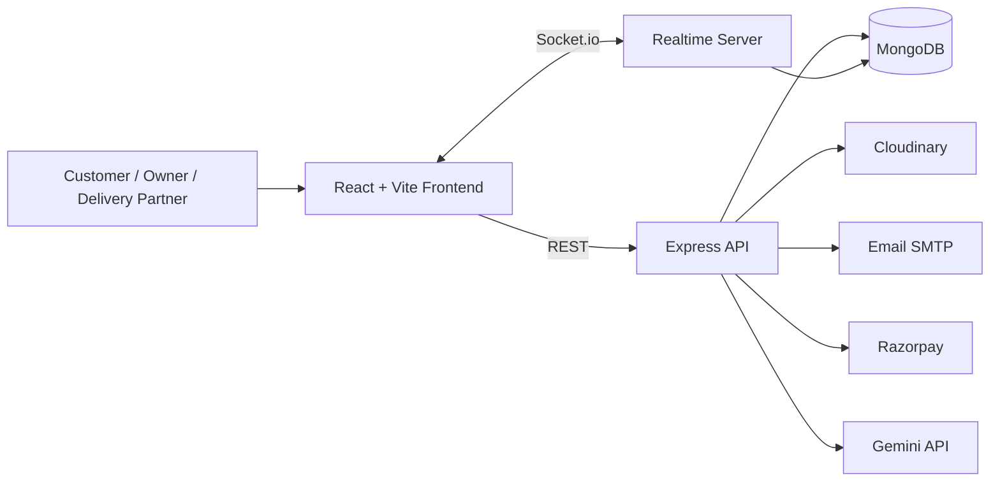
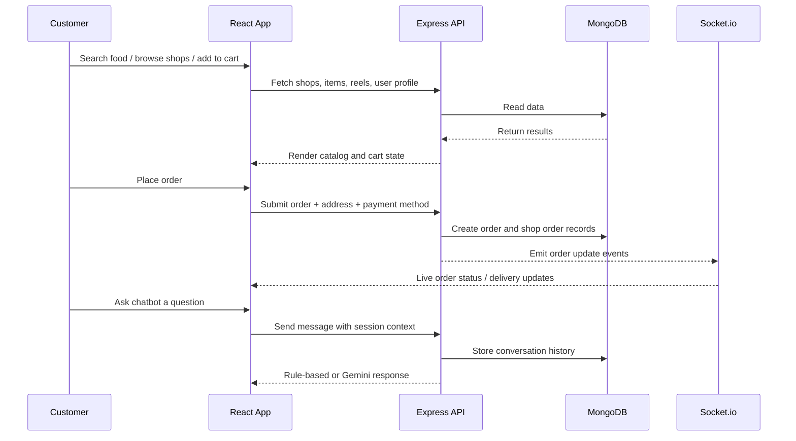

# Vingo - Food Delivery + Reel

[](https://nodejs.org/)
[](https://react.dev/)
[](https://vitejs.dev/)
[](https://www.mongodb.com/)
[](https://socket.io/)
[](https://opensource.org/licenses/ISC)

> A full-stack, role-aware food delivery platform with real-time order tracking, short-form food reels, shop management, and a hybrid AI support chatbot.

## Overview

Vingo is a production-style food delivery and social commerce platform built for three distinct roles: customers, restaurant owners, and delivery partners. It combines restaurant discovery, cart and checkout flows, delivery tracking, review management, and reel-based content discovery into one app.

The standout feature is the in-app support assistant. It uses a rule-based knowledge base for common questions and falls back to Gemini when the query is not covered by predefined logic. That gives the project both deterministic support for common workflows and a more conversational experience for edge cases.

## Key Features

- Role-based experiences for `user`, `owner`, and `deliveryBoy`
- City-aware restaurant and item discovery
- Search by item name, category, and location
- Persistent cart with quantity management and localStorage sync
- Checkout with Razorpay online payment support and COD flow
- Order lifecycle management for customer, owner, and delivery partner
- OTP-based delivery verification
- Real-time updates through Socket.io
- Live delivery location tracking on map-based screens
- Food reels with upload, like, comment, reply, save, and edit flows
- Reviews for menu items
- Password reset with email OTP
- Hybrid chatbot for order, payment, refund, support, and FAQ queries
- Media uploads through Cloudinary
- MongoDB-backed persistence for users, shops, orders, reels, and chat sessions

## Project Architecture

The project is split into a React frontend and an Express/MongoDB backend. The backend exposes REST APIs for auth, shops, items, orders, reviews, reels, users, and chat. Socket.io is used for real-time order and delivery events.



### System Design / Workflow


## Tech Stack

| Layer | Technologies |
|---|---|
| Frontend | React 19, Vite, React Router, Redux Toolkit, Tailwind CSS 4, Axios, React Toastify, React Icons, Recharts, Leaflet |
| Backend | Node.js, Express 5, Mongoose, Socket.io, Multer, CORS, Cookie Parser |
| Database | MongoDB |
| Auth | JWT, HTTP-only cookies, Firebase Google auth setup |
| Payments | Razorpay |
| Media Storage | Cloudinary |
| Email | Nodemailer SMTP |
| AI / Chat | Google Gemini API fallback plus rule-based knowledge base |

## AI / LLM Technologies Used

- Gemini 1.5 Flash fallback for support responses
- Rule-based FAQ layer for deterministic answers to common delivery, payment, refund, login, and app-help questions
- Session-based conversation history stored in MongoDB
- Context awareness from user role and current page
- Support session cleanup through TTL index for privacy-focused retention

## Folder Structure

```text
.
├── render.yaml
├── backend
│   ├── index.js
│   ├── socket.js
│   ├── config
│   ├── controllers
│   ├── middlewares
│   ├── models
│   └── routes
└── frontend
    ├── src
    │   ├── components
    │   ├── hooks
    │   ├── pages
    │   ├── redux
    │   └── socket.js
    ├── utils
    ├── vite.config.js
    └── eslint.config.js
```

## Installation Guide

### Prerequisites

- Node.js 18 or newer
- MongoDB connection string
- Cloudinary account
- Razorpay account
- SMTP email credentials
- Gemini API key for chatbot fallback

### Backend Setup

```bash
cd backend
npm install
```

Create a `.env` file in `backend/` with the required variables listed below, then start the server:

```bash
npm run dev
```

### Frontend Setup

```bash
cd frontend
npm install
npm run dev
```

## Environment Variables

### Backend

| Variable | Purpose |
|---|---|
| `PORT` | Backend port, defaults to `5000` |
| `NODE_ENV` | Controls production cookie and proxy behavior |
| `MONGO_URI` | MongoDB connection string |
| `JWT_SECRET` | JWT signing secret |
| `FRONTEND_URL` | Allowed frontend origin in production |
| `CLOUDINARY_CLOUD_NAME` | Cloudinary cloud name |
| `CLOUDINARY_API_KEY` | Cloudinary API key |
| `CLOUDINARY_API_SECRET` | Cloudinary API secret |
| `EMAIL_USER` | SMTP sender email |
| `EMAIL_PASS` | SMTP app password |
| `RAZORPAY_KEY_ID` | Razorpay public key |
| `RAZORPAY_KEY_SECRET` | Razorpay secret key |
| `GEMINI_API_KEY` | Gemini API key for chatbot fallback |

### Frontend

| Variable | Purpose |
|---|---|
| `VITE_SERVER_URL` | Frontend API base URL used by deployment tooling |
| `VITE_API_URL` | Chat widget API base URL fallback |
| `VITE_GEOAPIKEY` | Location/geocoding integration key |
| `VITE_RAZORPAY_KEY_ID` | Razorpay key exposed to checkout UI |
| `VITE_FIREBASE_APIKEY` | Firebase auth API key |

## Running the Project

### Development

1. Start the backend from `backend/`.
2. Start the frontend from `frontend/`.
3. Open the frontend in the browser and sign in as a customer, owner, or delivery partner.

### Production Notes

- The backend is configured for Render-style deployment via `render.yaml`.
- CORS is restricted to the local Vite origin and the deployed frontend domain.
- Cookies are configured as secure and `sameSite: none` in production.

## API Endpoints

### Auth

- `POST /api/auth/signup`
- `POST /api/auth/signin`
- `GET /api/auth/signout`
- `POST /api/auth/googleauth`
- `POST /api/auth/sendotp`
- `POST /api/auth/verifyotp`
- `POST /api/auth/resetpassword`

### Users

- `GET /api/user/current`
- `POST /api/user/update-location`
- `GET /api/user/search-items`

### Shops

- `GET /api/shop/getall`
- `GET /api/shop/getcurrent`
- `POST /api/shop/editshop`
- `GET /api/shop/getshopsbycity/:city`
- `GET /api/shop/getshopbyid/:shopId`

### Items

- `GET /api/item/getitemsbyshop/:shopId`
- `GET /api/item/getitemsbycity/:city`
- `POST /api/item/additem`
- `POST /api/item/edititem/:itemId`
- `GET /api/item/delete/:itemId`
- `GET /api/item/getbyid/:itemId`

### Orders

- `POST /api/order/placeorder`
- `POST /api/order/verify-razorpay`
- `GET /api/order/getmy`
- `GET /api/order/shop-orders`
- `POST /api/order/update-order-status/:orderId/:shopId`
- `GET /api/order/getassignments`
- `GET /api/order/accept-assignment/:assignmentId`
- `GET /api/order/current-order`
- `POST /api/order/update-location`
- `GET /api/order/delivery-location/:orderId/:shopOrderId`
- `POST /api/order/send-otp`
- `POST /api/order/verify-otp`
- `GET /api/order/stats/today`
- `GET /api/order/stats/month`
- `GET /api/order/my-delivered-orders`
- `GET /api/order/payment/daily`
- `GET /api/order/payment/weekly`
- `GET /api/order/payment/monthly`
- `GET /api/order/my-location`
- `GET /api/order/:orderId`

### Reviews

- `GET /api/review/item/:itemId`
- `GET /api/review/can-review/:itemId`
- `POST /api/review/add/:itemId`
- `PUT /api/review/update/:reviewId`
- `DELETE /api/review/delete/:reviewId`

### Reels

- `POST /api/reel/upload`
- `GET /api/reel/getAll`
- `GET /api/reel/shop/:shopId`
- `GET /api/reel/like/:reelId`
- `POST /api/reel/comment/:reelId`
- `POST /api/reel/reply/:reelId/:commentId`
- `PUT /api/reel/edit/:reelId`
- `DELETE /api/reel/delete/:reelId`
- `GET /api/reel/save/:reelId`
- `GET /api/reel/saved`

### Chat

- `POST /api/chat/message`
- `GET /api/chat/history/:sessionId`
- `DELETE /api/chat/history/:sessionId`
- `GET /api/chat/sessions`

## Screenshots

### Home Screen

_Add a screenshot of the customer home feed here._

### Food Reels

_Add a screenshot of the vertical reels feed here._

### Owner Dashboard

_Add a screenshot of the owner order-management view here._

### Chat Support

_Add a screenshot of the chatbot UI here._

## Challenges Solved

- Designed one codebase to serve three product roles with different UI states and permissions
- Implemented real-time order updates and live delivery tracking through Socket.io
- Coordinated multiple order outcomes, including COD and Razorpay flows
- Added a hybrid chatbot that can answer common support questions deterministically and escalate to Gemini when needed
- Managed media-heavy workflows for reels using Cloudinary upload and server-side trimming
- Preserved cart state locally while keeping server-side order creation consistent

## Learning Outcomes

- Building role-based product flows with shared backend entities
- Managing real-time systems alongside standard REST APIs
- Designing a practical chatbot that combines rules with LLM fallback
- Handling authenticated media uploads and OTP verification flows
- Structuring a full-stack app for production-style deployment

## Why This Project Stands Out

- It is not just a food delivery clone; it adds social content, support automation, and real-time logistics
- It supports three operational roles instead of a single consumer flow
- It demonstrates end-to-end engineering across frontend, backend, database, realtime, payments, email, and AI
- It includes features recruiters care about: auth, payments, uploads, sockets, tracking, and conversational support

## Future Improvements

- Add in-app push notifications for order status changes
- Replace the current support bot with retrieval over a richer FAQ and order context
- Add automated tests for checkout, reel uploads, and chatbot responses
- Introduce analytics dashboards for conversion, retention, and delivery SLA metrics
- Add admin moderation tools for reported reels and reviews
- Harden rate limiting, audit logging, and input validation across public endpoints

## License

ISC, as declared in the backend package configuration. Add a root-level `LICENSE` file if you want to publish the project with an explicit repository-wide license.

